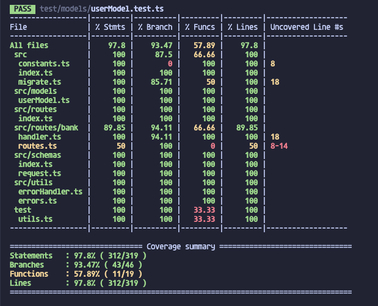

<div align="center">
  <h3 align="center">Banking Startup Services</h3>
</div>


<!-- TABLE OF CONTENTS -->
<details>
  <summary>Table of Contents</summary>
  <ol>
    <li>
      <a href="#about-the-project">About The Project</a>
      <ul>
        <li><a href="#built-with">Built With</a></li>
      </ul>
    </li>
    <li>
      <a href="#getting-started">Getting Started</a>
      <ul>
        <li><a href="#prerequisites">Prerequisites</a></li>
        <li><a href="#run-from-the-cli">Run from the cli</a></li>
        <li><a href="#run-using-docker">Run using docker</a></li>
        <li><a href="#coverage-and-documentation">Coverage and Documentation</a></li>
      </ul>
    </li>
  </ol>
</details>


<!-- ABOUT THE PROJECT -->
## About The Project

This is project which exposes two endpoints for interacting with Bank accounts. They are provided by a web server which exposes two endpoints:
- GET: for getting balance of a bank account;
- POST: get adding or withdrawing to and from an account. If the account does not exist, it should be created at the time of the request.
<a id="readme-top"></a>


### Built With

In this section all tools and technology used have been listed below in order to give an insight on the kind of project and required dependencies.

* [![Node][NodeJS]][Node-url]
* [![Fastify][FastifyJS]][Fastify-url]
* [![Docker][Docker]][Docker-url]
* [![Postgres][Postgres]][Postgres-url]

<p align="right">(<a href="#readme-top">back to top</a>)</p>


<!-- GETTING STARTED -->
## Getting Started

In this section have been reported all the information to run a local instance of the project both usign docker and running directly from the cli.

### Prerequisites

First thing is install nvm which is a node version manager which provide a way to run different node version. There is a .nvmrc file which enables users to run the correct version of Node used for development. The command to install the version and than use it is:
* nvm
  ```sh
  nvm install && nvm use
  ```
If on your machine has been installed a version of nvm just use the 'nvm use' command and after install all the required dependency through the following command:
* npm
  ```sh
  npm install
  ```

### Run from the cli

_it is possible to run the project using cli commands. The first thing is to create a ".env" file copying from the ".env.example" one and set with correct information. If you leave the ones reported in the example file you can just go further with the instruction_

1. Start a docker container running postgres instance using:
  * postgres
    ```sh
      npm run start:db
    ```
    if you prefer you can skip this step and go further;
2. Run db migration after checking correct information inside .env file using this command:
  ```sh
    npm run migration
  ```
  it compiles code in javascript and reading from .env variables, starts all the migrations with some dummy data;
3. Check variable inside .env file and after start the instance using:
   ```sh
   npm run dev
   ```
   this automatically reads variables inside .env file and connects to db without compile the code in typescript.

<p align="right">(<a href="#readme-top">back to top</a>)</p>

### Run using docker

_If you want to run inside docker you can leave everything as is and simply run the following commands_

1. Compile all the code:
  * compile
    ```sh
      npm run compile
    ```
    if you prefer you can skip this step and go further;
2. Just launch containerized project
  * run docker instance
    ```sh
      docker compose up
    ```

<p align="right">(<a href="#readme-top">back to top</a>)</p>

### Coverage and Documentation

Running the project using cli and setting TARGET_ENV=dev enables user to load swagger inside Fastify Instance. Otherwise there is a swagger file in json format which can be imported in a Swagger UI instance. The project has reached a coverage of ~95%. In order to check the coverage just use: 
```sh
  npm run test
```



<p align="right">(<a href="#readme-top">back to top</a>)</p>

### Bonus
It is possible to run linting and automatically linting using the following commands:
* lint
  ```sh
    npm run lint
  ```

* lint fix
  ```sh
    npm run lint:fix
  ```

If you want to commit some files using Semantic Commit after git add there is Commitizen command configured to run using npm cli:
* commitizen
  ```sh
    npm run commit 
  ```


[NodeJS]: https://img.shields.io/badge/node-99CC7D?style=for-the-badge&logo=node.js&logoColor=black
[Node-url]: https://nodejs.org/
[FastifyJS]: https://img.shields.io/badge/fastify.js-000000?style=for-the-badge&logo=fastify&logoColor=white
[Fastify-url]: http://fastify.dev/
[Docker]: https://img.shields.io/badge/docker-0C49C2?style=for-the-badge&logo=docker&logoColor=white
[Docker-url]: https://www.docker.com
[Postgres]: https://img.shields.io/badge/posgresql-50b0f0?style=for-the-badge&logo=postgresql&logoColor=white
[Postgres-url]: https://www.postgresql.org